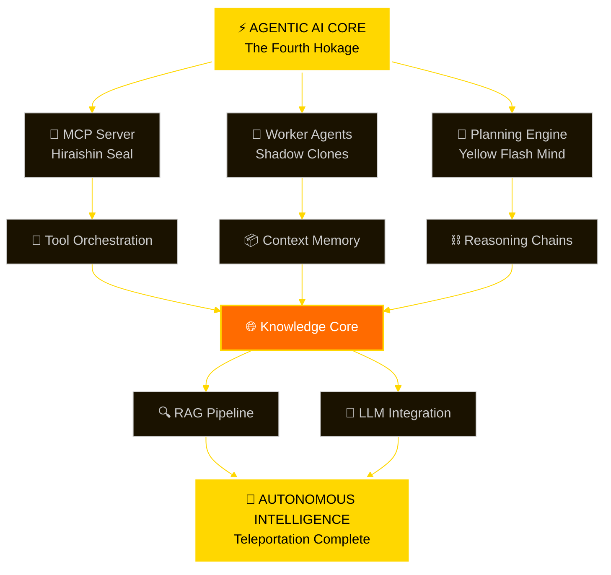
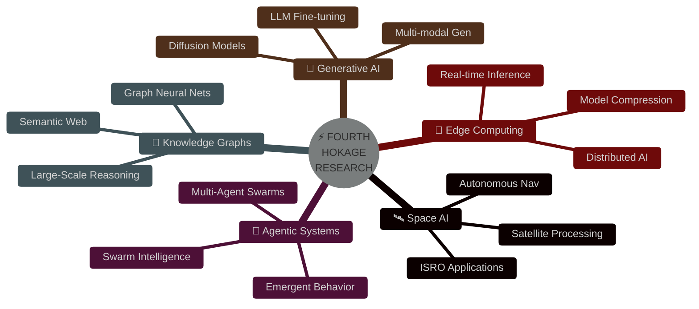

<div align="center">

<!-- CYBERPUNK HEADER - Yellow Flash of the Leaf -->


</div>

<!-- MINATO KUNAI DIVIDER -->
<div align="center">

</div>

<!-- MINATO GIF SHOWCASE -->
<div align="center">


<br clear="both"/>

</div>

<br/>

<!-- NEON STATS BADGES -->
<div align="center">


<a href="https://github.com/Anshuman-Tripathi-minato?tab=followers">
  
</a>
<a href="https://github.com/Anshuman-Tripathi-minato?tab=repositories&sort=stargazers">
  
</a>

</div>

<br/>

<!-- GLITCH DIVIDER -->


<br/>

<!-- TERMINAL / WHO AM I -->
<div align="center">

```
╔═══════════════════════════════════════════════════════════════════════╗
║  ⚡ HIRAISHIN TERMINAL v4.0 — FOURTH HOKAGE INTERFACE               ║
╠═══════════════════════════════════════════════════════════════════════╣
║                                                                       ║
║  $ identity --reveal                                                  ║
║  ▶  Anshuman Tripathi  |  alias: Minato  |  loc: India               ║
║                                                                       ║
║  $ cat mission.log                                                    ║
║  ▶  Engineer autonomous AI agents that transcend limits              ║
║  ▶  Like Minato's Hiraishin — instant, precise, unstoppable          ║
║                                                                       ║
║  $ skills --scan --mode=jutsu                                        ║
║  ▶  ⚡ Model Context Protocol (MCP) Systems                          ║
║  ▶  🧠 Multi-Agent Orchestration & RAG Pipelines                    ║
║  ▶  🎨 Generative AI & LLM Engineering                               ║
║  ▶  📊 Advanced Data Analytics & ML                                  ║
║  ▶  🔐 Blockchain & Cryptographic Systems                            ║
║                                                                       ║
║  $ echo $DESTINY                                                      ║
║  ▶  ISRO | NASA | AI Research Leadership                             ║
║                                                                       ║
╚═══════════════════════════════════════════════════════════════════════╝
```

</div>

<br/>

<!-- MINATO BATTLE ANIMATION SECTION -->
<div align="center">

## ⚡ HIRAISHIN NO JUTSU — ARCHITECTURE



```mermaid
%%{init: {'theme':'dark', 'themeVariables': { 'primaryColor':'#FFD700','primaryTextColor':'#000','primaryBorderColor':'#FFD700','lineColor':'#FFD700','secondaryColor':'#1a1200','tertiaryColor':'#0d0d0d', 'background':'#0d0d0d', 'mainBkg':'#1a1200'}}}%%
graph TB
    A[⚡ AGENTIC AI CORE<br/>The Fourth Hokage] --> B[🔮 MCP Server<br/>Hiraishin Seal]
    A --> C[🤖 Worker Agents<br/>Shadow Clones]
    A --> D[🧠 Planning Engine<br/>Yellow Flash Mind]

    B --> E[🔧 Tool Orchestration]
    C --> F[📦 Context Memory]
    D --> G[⛓️ Reasoning Chains]

    E --> H[🌐 Knowledge Core]
    F --> H
    G --> H

    H --> I[🔍 RAG Pipeline]
    H --> J[🤯 LLM Integration]

    I --> K[🎯 AUTONOMOUS INTELLIGENCE<br/>Teleportation Complete]
    J --> K

    style A fill:#FFD700,stroke:#fff,stroke-width:3px,color:#000
    style K fill:#FFD700,stroke:#fff,stroke-width:3px,color:#000
    style H fill:#ff6b00,stroke:#FFD700,stroke-width:2px,color:#fff
```

</div>

<br/>

<!-- GLASSMORPHISM SKILL TABLE -->
<div align="center">

## 🥷 JUTSU MASTERY MATRIX

| ⚡ DOMAIN | 🛠️ TECH STACK | 💪 POWER LEVEL | 🔥 IMPACT |
|:---------:|:-------------:|:--------------:|:---------:|
| **Agentic AI** | MCP, Multi-Agent, Context Reasoning |  | ⭐⭐⭐⭐⭐ |
| **RAG Systems** | Vector DBs, Embeddings, Semantic Search |  | ⭐⭐⭐⭐⭐ |
| **Generative AI** | Stable Diffusion, LLM Foundry, Gemini |  | ⭐⭐⭐⭐ |
| **Data Analytics** | EDA, Pattern Recognition, Anomaly Detection |  | ⭐⭐⭐⭐ |
| **Full Stack** | MERN, React, Node.js, TypeScript |  | ⭐⭐⭐⭐ |
| **Blockchain** | Hyperledger, Smart Contracts, P2P |  | ⭐⭐⭐⭐ |

</div>

<br/>


<!-- TECH ARSENAL -->
<details open>
<summary><h2>🔧 SHINOBI TECH ARSENAL</h2></summary>
<br/>

<div align="center">

**⚡ LANGUAGES — ELEMENTAL AFFINITIES**


<br/><br/>

**🧠 AI / ML — FORBIDDEN JUTSU**


<br/>


<br/><br/>

**🌐 WEB DEV — SHADOW CLONE STACK**


<br/><br/>

**☁️ DEVOPS — VILLAGE INFRASTRUCTURE**


<br/><br/>

**🔐 BLOCKCHAIN — SEAL TECHNIQUES**


</div>

</details>

<br/>


<!-- PROJECT SHOWCASE -->
<details open>
<summary><h2>🚀 S-RANK MISSION FILES</h2></summary>

<br/>

---

### ⚡ [MCP-Based Autonomous Stock Analytics & Predictor](https://github.com/Anshuman-Tripathi-minato)
> **🏢 Straive Internship — Classified Operation**

<div align="center">


</div>

```python
class HiraishiStockAgent:
    """
    ⚡ Autonomous agent — strikes market data at the speed of
    Minato's Flying Thunder God Technique
    """
    seals = {
        "data_retrieval":   ["Real-time feeds", "Historical", "Multi-source"],
        "pattern_vision":   ["Candlestick", "Trends", "Anomalies"],
        "prediction_core":  ["ML Models", "Context-aware", "Autonomous"],
        "reasoning_chains": ["Multi-step", "Tool-calling", "Self-correcting"]
    }

    def hiraishin_workflow(self):
        return [
            "📡 Mark target — fetch live market data via MCP",
            "🧠 Read the battlefield — context-aware pattern analysis",
            "📊 Predict the strike — confidence-scored ML outputs",
            "⚡ Teleport — execute autonomous decision workflows",
            "🎯 Land the hit — deliver actionable intelligence"
        ]
```
**`MCP Server`** **`Python`** **`LLM Tool-Calling`** **`Financial APIs`** **`Autonomous Agents`**

---

### 📚 [RAG-Based Enterprise Knowledge Assistant](https://github.com/Anshuman-Tripathi-minato)
> **🎯 Production-Ready Infinite Tsukuyomi for Docs**

<div align="center">


</div>

```javascript
const KnowledgeJutsu = {
  architecture: {
    embedding:  "Sentence Transformers",
    vectorDB:   "Pinecone / ChromaDB",
    retrieval:  "Hybrid Dense+Sparse",
    generation: "GPT-4 / Claude"
  },
  powers: [
    "🔍 Semantic search across 1M+ documents",
    "📄 Multi-format: PDF, DOCX, TXT, HTML",
    "⚡ Real-time indexing — Hiraishin speed",
    "🏢 Enterprise-grade zero-trust security",
    "🎯 Context-aware answers, zero hallucination"
  ]
}
```
**`RAG`** **`Vector Embeddings`** **`MCP Server`** **`LangChain`** **`Semantic Search`**

---

### 🔐 [Decentralized Cloud Storage System](https://github.com/Anshuman-Tripathi-minato)
> **🎓 Major Project — Hokage-Level Seal Architecture**

<div align="center">


</div>

```
✅  AES-256 Encryption        ← Eight Trigrams Sealing Style
✅  RSA-2048 Key Exchange      ← Flying Thunder God Seal
✅  File Chunking + Redundancy ← Shadow Clone Distribution
✅  Hyperledger Integration    ← Immutable Scroll Records
✅  Zero-Knowledge Proofs      ← Hidden Leaf Intelligence
✅  libp2p P2P Network         ← Shinobi Relay Network
✅  Smart Contract Audits      ← Hokage Authorization Chain
✅  Client-Side Key Ownership  ← Kekkei Genkai Protection
```
**`Hyperledger Fabric`** **`libp2p`** **`AES-256`** **`React`** **`Node.js`**

---

### 📊 [Intelligent Supply Chain Optimizer](https://github.com/Anshuman-Tripathi-minato)
> **🎯 ML-Powered Logistics — Chunin Exam Rank**

<div align="center">


</div>

```python
class SupplyChainShinobi:
    jutsu = [
        "Max-Flow Min-Cut     ← Graph Theory Rasengan",
        "ML Demand Regression ← Sage Mode Prediction",
        "Congestion Scoring   ← Sharingan Route Scan",
        "Dynamic Optimization ← Hiraishin Re-routing"
    ]
    mission_results = {
        "delivery_time":        "↓ 40%  — teleportation speed",
        "operational_cost":     "↓ 30%  — shadow clone efficiency",
        "customer_satisfaction":"↑ 85%  — village trust unlocked"
    }
```

---

### 💬 [E-Chat: Military-Grade Encrypted Messenger](https://github.com/Anshuman-Tripathi-minato)
> **🔒 Zero-Knowledge — Even Madara Can't Intercept**

<div align="center">


</div>

```typescript
interface AnbuMessaging {
  encryption:     "AES-256-GCM",
  identity:       "8-char Seal ID — No Phone, No Email",
  architecture:   "Zero-Knowledge",
  features: [
    "🔐 End-to-End Encryption",
    "👥 Secure Ops Group Channels",
    "🚫 No Tracking, No Logs",
    "⚡ Real-time P2P WebRTC",
    "🔑 Client-Side Kekkei Genkai"
  ]
}
```
**`WebRTC`** **`Socket.io`** **`React`** **`AES-256-GCM`** **`Zero-Knowledge`**

</details>

<br/>


<!-- SNAKE ANIMATION -->


</div>

</details>

<br/>


<!-- RESEARCH NEXUS -->
<details>
<summary><h2>🔬 KAGE-LEVEL RESEARCH NEXUS</h2></summary>
<br/>

<div align="center">


```mermaid
%%{init: {'theme':'dark'}}%%
mindmap
  root((⚡ FOURTH<br/>HOKAGE<br/>RESEARCH))
    🛰️ Space AI
      ISRO Applications
      Satellite Processing
      Autonomous Nav
    🤖 Agentic Systems
      Multi-Agent Swarms
      Emergent Behavior
      Swarm Intelligence
    🔗 Knowledge Graphs
      Large-Scale Reasoning
      Graph Neural Nets
      Semantic Web
    🎨 Generative AI
      Diffusion Models
      LLM Fine-tuning
      Multi-modal Gen
    📡 Edge Computing
      Real-time Inference
      Model Compression
      Distributed AI
```

</div>

<div align="center">

| 🔬 Research | 🎯 Goal | 📅 ETA |
|:-----------:|:-------:|:------:|
| **Advanced MCP** | Multi-agent orchestration | Q1 2026 |
| **Multi-modal RAG** | Vision + Text + Audio | Q2 2026 |
| **Anomaly Detection** | Real-time ML pipelines | Q2 2026 |
| **Space AI** | ISRO/NASA prep | 2026-27 |
| **Open Source** | AI community tools | Ongoing |

</div>

</details>

<br/>

<!-- CONNECT -->
<div align="center">

## 🌐 OPEN CHANNELS — NEURAL COMMS

<a href="https://www.linkedin.com/in/anshuman-tripathi-3b570a259/">
  
</a>
<a href="mailto:tripathianshuman18@gmail.com">
  
</a>
<a href="https://github.com/Anshuman-Tripathi-minato">
  
</a>
<a href="https://twitter.com/anshuman_minato">
  
</a>

<br/><br/>

<a href="https://www.buymeacoffee.com/anshumanminato">
  
</a>

</div>

<br/>

<!-- PHILOSOPHY - HOKAGE EDITION -->
<div align="center">

## 💛 HOKAGE PHILOSOPHY

> ### *"I want to be the kind of ninja... everyone can count on."*
> *— Minato Namikaze, Fourth Hokage*

<br/>

> ### *"In the age of AI, we're not just writing code — we're architecting the future."*
> *— Anshuman Tripathi, Agentic AI Architect*

<br/>

```python
def yellow_flash_philosophy():
    return {
        "nindo":    "Build AI that amplifies human potential",
        "vision":   "Intelligent agents solving humanity's greatest challenges",
        "values":   ["Speed", "Precision", "Protection", "Sacrifice", "Innovation"],
        "jutsu":    "Hiraishin no Jutsu — arrive before the problem does",
        "dream":    "ISRO | NASA | AGI Research Leadership"
    }
```

</div>

<br/>

<!-- ACHIEVEMENTS -->
<div align="center">

## 🏅 S-RANK ACHIEVEMENTS


</div>

<br/>

<!-- FOOTER -->


<div align="center">


<br/>

**⚡ FROM [ANSHUMAN TRIPATHI — THE YELLOW FLASH](https://github.com/Anshuman-Tripathi-minato) ⚡**

</div>
