<div align="center">

<!-- HOLOGRAPHIC HEADER -->


<br/><br/>

<!-- MATRIX RAIN ANIMATION -->


<br/><br/>

<!-- VISITOR COUNTER WITH CUSTOM STYLE -->


<br/>

<!-- DYNAMIC BADGES -->
<a href="https://github.com/Anshuman-Tripathi-minato?tab=followers">
  
</a>
<a href="https://github.com/Anshuman-Tripathi-minato?tab=repositories&sort=stargazers">
  
</a>

<br/><br/>

<!-- TYPING ANIMATION -->
<a href="https://git.io/typing-svg">
  
</a>

</div>

<br/>

<!-- GLOWING DIVIDER -->


<br/>

<!-- TERMINAL STYLE INTRO -->
<div align="center">
  
```ascii
╔══════════════════════════════════════════════════════════════════════╗
║                                                                      ║
║   ┌─────────────────────────────────────────────────────────────┐   ║
║   │  $ whoami                                                    │   ║
║   │  > Anshuman Tripathi (Minato)                               │   ║
║   │                                                              │   ║
║   │  $ cat mission.txt                                           │   ║
║   │  > Engineering autonomous AI agents that transcend          │   ║
║   │    human limitations and redefine possibilities             │   ║
║   │                                                              │   ║
║   │  $ ./skills --list                                           │   ║
║   │  > ⚡ Model Context Protocol (MCP) Systems                   │   ║
║   │  > 🧠 Multi-Agent Orchestration & RAG Pipelines             │   ║
║   │  > 🎨 Generative AI & LLM Engineering                        │   ║
║   │  > 📊 Advanced Data Analytics & ML                           │   ║
║   │  > 🔐 Blockchain & Cryptographic Systems                     │   ║
║   │                                                              │   ║
║   │  $ echo $DREAM                                               │   ║
║   │  > ISRO | NASA | AI Research Leadership                     │   ║
║   └─────────────────────────────────────────────────────────────┘   ║
║                                                                      ║
╚══════════════════════════════════════════════════════════════════════╝
```

</div>

<br/>

<!-- TECH STACK VISUALIZATION -->
<details open>
<summary><h2>⚡ NEURAL NETWORK ARCHITECTURE</h2></summary>
<br/>

<div align="center">



</div>

```mermaid
%%{init: {'theme':'dark', 'themeVariables': { 'primaryColor':'#00F7FF','primaryTextColor':'#fff','primaryBorderColor':'#00F7FF','lineColor':'#00F7FF','secondaryColor':'#1a1a2e','tertiaryColor':'#16213e'}}}%%
graph TB
    A[🧠 AGENTIC AI CORE] --> B[MCP Server]
    A --> C[Worker Agents]
    A --> D[Planning Engine]
    
    B --> E[Tool Orchestration]
    C --> F[Context Management]
    D --> G[Reasoning Chains]
    
    E --> H[Knowledge Graphs]
    F --> H
    G --> H
    
    H --> I[RAG Pipeline]
    H --> J[LLM Integration]
    
    I --> K[🎯 AUTONOMOUS INTELLIGENCE]
    J --> K
    
    style A fill:#00F7FF,stroke:#fff,stroke-width:3px,color:#000
    style K fill:#00F7FF,stroke:#fff,stroke-width:3px,color:#000
    style H fill:#ff6b6b,stroke:#fff,stroke-width:2px,color:#fff
```

### 🎯 EXPERTISE MATRIX

<div align="center">

| 🚀 DOMAIN | 🛠️ TECHNOLOGIES | 💪 MASTERY | 📈 IMPACT |
|:---------:|:---------------:|:----------:|:---------:|
| **Agentic AI** | MCP, Multi-Agent Systems, Context Reasoning |  | ⭐⭐⭐⭐⭐ |
| **RAG Systems** | Vector DBs, Embeddings, Semantic Search |  | ⭐⭐⭐⭐⭐ |
| **Generative AI** | Stable Diffusion, LLM Foundry, Gemini SDK |  | ⭐⭐⭐⭐ |
| **Data Analytics** | EDA, Pattern Recognition, Anomaly Detection |  | ⭐⭐⭐⭐ |
| **Full Stack** | MERN, React, Node.js, TypeScript |  | ⭐⭐⭐⭐ |
| **Blockchain** | Hyperledger, Smart Contracts, P2P Networks |  | ⭐⭐⭐⭐ |

</div>

</details>

<br/>

<!-- TECH STACK CLOUD -->
<details open>
<summary><h2>🔧 TECHNOLOGY ARSENAL</h2></summary>
<br/>

<div align="center">

<!-- Programming Languages -->


<br/><br/>

<!-- AI/ML & Data Science -->


<br/>

<!-- Web Development -->


<br/><br/>

<!-- DevOps & Tools -->


<br/><br/>

<!-- Blockchain & Security -->


</div>

</details>

<br/>

<!-- PROJECT SHOWCASE -->
<details open>
<summary><h2>🚀 QUANTUM LEAP PROJECTS</h2></summary>
<br/>

<!-- PROJECT 1 -->
<div align="center">

### 🤖 [MCP-Based Autonomous Stock Analytics & Predictor](https://github.com/Anshuman-Tripathi-minato)
#### 🏢 Straive Internship Project


</div>

```python
class MCPStockAgent:
    """
    Autonomous agent system leveraging Model Context Protocol
    for real-time financial analysis and prediction
    """
    def __init__(self):
        self.capabilities = {
            "data_retrieval": ["Real-time", "Historical", "Multi-source"],
            "pattern_recognition": ["Candlestick", "Trends", "Anomalies"],
            "prediction_engine": ["ML Models", "Context-aware", "Autonomous"],
            "reasoning": ["Multi-step", "Tool-calling", "Self-correcting"]
        }
    
    def autonomous_workflow(self):
        return """
        1. 📡 Fetch live market data via MCP tools
        2. 🧠 Analyze patterns using context reasoning
        3. 📊 Generate predictions with confidence scores
        4. ⚡ Execute autonomous decision workflows
        5. 🎯 Deliver actionable insights
        """
```

<div align="center">

**Tech Stack:** `MCP Server` `Python` `LLM Tool-Calling` `Financial APIs` `Autonomous Agents`


---

</div>

<!-- PROJECT 2 -->
<div align="center">

### 📚 [RAG-Based Enterprise Knowledge Assistant](https://github.com/Anshuman-Tripathi-minato)
#### 🎯 Production-Ready AI System


</div>

```javascript
const RAGSystem = {
  architecture: {
    embedding: "Sentence Transformers",
    vectorDB: "Pinecone / ChromaDB",
    retrieval: "Hybrid (Dense + Sparse)",
    generation: "GPT-4 / Claude"
  },
  features: [
    "🔍 Semantic search across 1M+ documents",
    "📄 Multi-format support (PDF, DOCX, TXT, HTML)",
    "⚡ Real-time indexing and updates",
    "🏢 Enterprise-grade security",
    "🎯 Context-aware responses"
  ],
  useCases: ["Legal Research", "Technical Docs", "Policy Management"]
}
```

<div align="center">

**Tech Stack:** `RAG` `Vector Embeddings` `MCP Server` `LangChain` `Semantic Search`

---

</div>

<!-- PROJECT 3 -->
<div align="center">

### 🔐 [Decentralized Cloud Storage System](https://github.com/Anshuman-Tripathi-minato)
#### 🎓 Major University Project - Blockchain Architecture


</div>

```solidity
// Blockchain-Powered Decentralized Storage
contract StorageNetwork {
    ✅ AES-256 Encryption
    ✅ RSA-2048 Key Exchange
    ✅ File Chunking & Redundancy
    ✅ Hyperledger Fabric Integration
    ✅ Zero-Knowledge Architecture
    ✅ P2P libp2p Network
    ✅ Smart Contract Audit Trails
    ✅ Client-Side Key Ownership
    
    function upload(file) {
        encrypt(file, AES256);
        chunk(file, 1MB);
        distribute(chunks, peerNetwork);
        recordOnBlockchain(metadata);
    }
}
```

<div align="center">

**Tech Stack:** `Hyperledger Fabric` `libp2p` `AES-256` `React` `Node.js` `Cryptography`


---

</div>

<!-- PROJECT 4 -->
<div align="center">

### 📊 [Intelligent Supply Chain Optimization](https://github.com/Anshuman-Tripathi-minato)
#### 🎯 ML-Powered Logistics Enhancement


</div>

```python
class SupplyChainOptimizer:
    """
    AI-driven system for real-time bottleneck detection
    and intelligent route optimization
    """
    algorithms = [
        "Max-Flow Min-Cut (Graph Theory)",
        "ML Regression (Demand Prediction)",
        "Weighted Congestion Scoring",
        "Dynamic Route Optimization"
    ]
    
    impact = {
        "delivery_time": "↓ 40%",
        "operational_cost": "↓ 30%",
        "customer_satisfaction": "↑ 85%"
    }
```

<div align="center">

**Tech Stack:** `Python` `Graph Analytics` `ML` `React Dashboard` `Real-time Processing`

---

</div>

<!-- PROJECT 5 -->
<div align="center">

### 💬 [E-Chat: Military-Grade Encrypted Messaging](https://github.com/Anshuman-Tripathi-minato)
#### 🔒 Zero-Knowledge Security Architecture


</div>

```typescript
interface SecureMessaging {
  encryption: "AES-256-GCM",
  authentication: "8-char Secure ID (No Phone/Email)",
  architecture: "Zero-Knowledge",
  features: [
    "🔐 End-to-End Encryption",
    "👥 Secure Group Chats",
    "🚫 No Data Tracking",
    "⚡ Real-time P2P",
    "🔑 Client-Side Keys"
  ]
}
```

<div align="center">

**Tech Stack:** `WebRTC` `Socket.io` `React` `AES Encryption` `Zero-Knowledge Architecture`

</div>

</details>

<br/>

<!-- GITHUB STATS SECTION -->
<details open>
<summary><h2>📊 NEURAL ACTIVITY METRICS</h2></summary>
<br/>

<div align="center">

<!-- GitHub Stats Card -->


<!-- Most Used Languages -->


</div>

<br/>

<div align="center">

<!-- GitHub Streak Stats -->


</div>

<br/>

<div align="center">

<!-- Contribution Graph -->


</div>

<br/>

<div align="center">

<!-- GitHub Trophies -->


</div>

<br/>

<div align="center">

<!-- 3D Contribution Graph -->


</div>

</details>

<br/>

<!-- RESEARCH & INTERESTS -->
<details>
<summary><h2>🔬 RESEARCH NEXUS</h2></summary>
<br/>

<div align="center">



</div>

```mermaid
%%{init: {'theme':'dark'}}%%
mindmap
  root((🧠 RESEARCH<br/>INTERESTS))
    🛰️ Space AI
      ISRO Applications
      Satellite Data Processing
      Autonomous Navigation
    🤖 Agentic Systems
      Multi-Agent Orchestration
      Emergent Behaviors
      Swarm Intelligence
    🔗 Knowledge Graphs
      Large-Scale Reasoning
      Graph Neural Networks
      Semantic Web
    🎨 Generative AI
      Diffusion Models
      LLM Fine-tuning
      Multi-modal Generation
    📡 Edge Computing
      Real-time Inference
      Model Optimization
      Distributed AI
```

### 🎯 CURRENT RESEARCH FOCUS

<div align="center">

| 🔬 Area | 🎯 Goal | 📅 Timeline |
|:-------:|:-------:|:-----------:|
| **Advanced MCP** | Multi-agent orchestration frameworks | Q1 2026 |
| **Multi-modal RAG** | Vision + Text + Audio integration | Q2 2026 |
| **Anomaly Detection** | Real-time ML pipelines | Q2 2026 |
| **Open Source** | Contributing to AI tools | Ongoing |
| **Space AI** | ISRO/NASA internship preparation | 2026-2027 |

</div>

### 📚 LEARNING ROADMAP

```python
learning_pipeline = {
    "phase_1_current": [
        "🧠 Advanced Multi-Agent RL",
        "🔗 Graph Neural Networks",
        "☁️ Distributed AI Systems",
        "⚛️ Quantum ML Basics"
    ],
    "phase_2_upcoming": [
        "🔮 Neuromorphic Computing",
        "🛡️ AI Safety & Alignment",
        "🛰️ Space-based AI Applications",
        "🧬 Bio-inspired AI"
    ],
    "phase_3_advanced": [
        "🌌 AGI Research",
        "🔬 Novel Architecture Design",
        "📡 Next-Gen Communication Protocols"
    ]
}
```

</details>

<br/>

<!-- GITHUB ACTIVITY -->
<details>
<summary><h2>⚡ REAL-TIME ACTIVITY</h2></summary>
<br/>

<!--START_SECTION:activity-->
<!--END_SECTION:activity-->

</details>

<br/>

<!-- BLOG POSTS (if you have a blog) -->
<details>
<summary><h2>📝 LATEST TECH INSIGHTS</h2></summary>
<br/>

<!-- BLOG-POST-LIST:START -->
<!-- BLOG-POST-LIST:END -->

> 🎯 Coming Soon: Technical deep-dives on Agentic AI, MCP systems, and cutting-edge ML techniques

</details>

<br/>

<!-- CONNECT SECTION -->
<div align="center">

## 🌐 NEURAL NETWORK CONNECTIONS

<a href="https://www.linkedin.com/in/anshuman-tripathi-3b570a259/">
  
</a>
<a href="mailto:tripathianshuman18@gmail.com">
  
</a>
<a href="https://github.com/Anshuman-Tripathi-minato">
  
</a>
<a href="https://twitter.com/anshuman_minato">
  
</a>

<br/><br/>

<!-- Support Section -->
### ☕ FUEL THE INNOVATION

<a href="https://www.buymeacoffee.com/anshumanminato">
  
</a>
<a href="https://ko-fi.com/anshumanminato">
  
</a>

</div>

<br/>

<!-- PHILOSOPHY -->
<div align="center">

## 💭 CORE PHILOSOPHY

> ### *"In the age of AI, we're not just writing code—we're architecting consciousness."*

> ### *"Every autonomous agent is a step toward artificial general intelligence."*

> ### *"The future isn't predicted, it's engineered—one neural network at a time."*

<br/>

```python
def life_philosophy():
    return {
        "mission": "Build AI that amplifies human potential",
        "vision": "A world where intelligent agents solve humanity's greatest challenges",
        "values": ["Innovation", "Open Source", "Continuous Learning", "Ethical AI"],
        "motto": "Code with purpose, build with passion, innovate with integrity"
    }
```

</div>

<br/>

<!-- ACHIEVEMENTS -->
<div align="center">

## 🏆 ACHIEVEMENT UNLOCKED


</div>

<br/>

<!-- SNAKE GAME -->
<div align="center">

## 🐍 CONTRIBUTION SNAKE


</div>

<br/>

<!-- FOOTER -->


<div align="center">

### 💙 CRAFTED WITH AI • POWERED BY PASSION • DRIVEN BY INNOVATION


<br/>

**⭐ FROM [ANSHUMAN TRIPATHI](https://github.com/Anshuman-Tripathi-minato) ⭐**

*Last Updated: 2026 • Built with 🤖 AI & ❤️*

</div>
